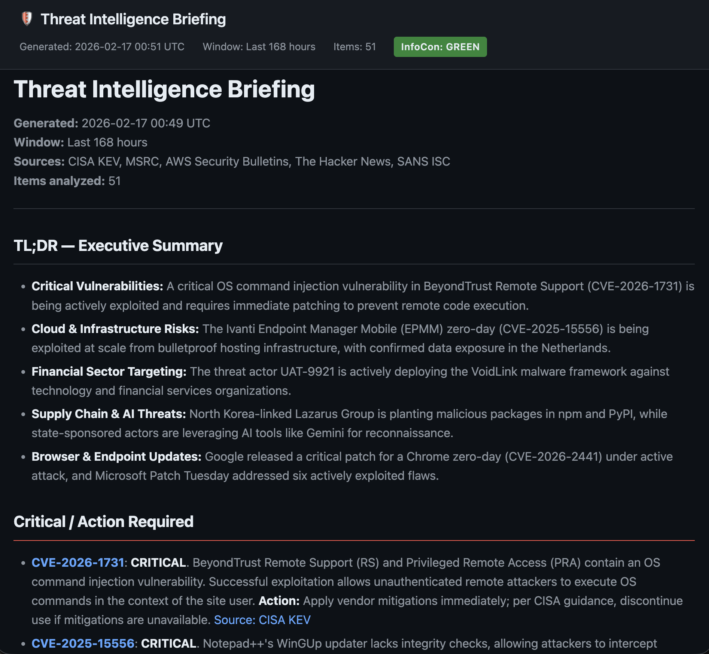

# threat-brief

CLI tool that generates daily threat intelligence briefings by aggregating data from multiple sources and summarizing them via a local LLM.



## Sources

- **CISA KEV** — Known Exploited Vulnerabilities catalog (JSON API)
- **MSRC** — Microsoft Security Response Center (CVRF API v3.0)
- **AWS Security Bulletins** — parsed from web page
- **The Hacker News** — threat intel RSS feed
- **Krebs on Security** — security news RSS feed
- **SANS ISC** — Internet Storm Center diary entries (RSS) + InfoCon threat level badge

## Setup

```bash
python3 -m venv .venv
source .venv/bin/activate
pip install -e .
cp config.yaml.example config.yaml
```

Edit `config.yaml` with your LLM endpoint and model. Requires a local LLM running an OpenAI-compatible API (e.g., [LM Studio](https://lmstudio.ai/) on `localhost:1234`).

## Organization Profile

The LLM summarization prompt is built dynamically from an optional `org_profile` section in `config.yaml`. This tailors the briefing to your organization's industry and technology stack.

Run the interactive setup wizard to configure it:

```bash
threat-brief init
```

Or add it manually to `config.yaml`. Every field is optional — the tool gracefully degrades with any combination of missing fields:

```yaml
org_profile:
  company_name: "Acme Corp"
  industry:
    - "Financial Services"
    - "FinTech"
  tech_stack:
    operating_systems:
      - "Windows 11"
      - "macOS"
    infrastructure:
      - "Active Directory"
      - "AWS (EC2, S3, Lambda, RDS)"
    applications:
      - "Microsoft 365"
      - "SolarWinds"
    languages_and_frameworks:
      - "Python"
      - ".NET"
    security_tools:
      - "CrowdStrike Falcon"
      - "Splunk"
```

When configured, the LLM will:
- Prioritize items affecting technologies in your stack
- Flag CVEs that specifically name products you use
- Score relevance higher for your industry verticals
- Deprioritize items irrelevant to your environment

When no `org_profile` is configured, the tool produces a general-purpose summary prioritized by severity.

## Usage

```bash
# Full briefing with LLM summarization
threat-brief

# Preview raw items without LLM
threat-brief --dry-run

# Custom lookback window (default: 48 hours)
threat-brief --hours 168

# Verbose logging
threat-brief -v

# Markdown output instead of HTML
threat-brief --format md

# Custom config file
threat-brief --config /path/to/config.yaml

# Interactive org profile setup
threat-brief init
```

## Output

Reports are saved to `./reports/` as dated files. The default format is **HTML** with a dark-themed report that opens automatically in your browser. Use `--format md` for plain Markdown.

The LLM-generated briefing includes:

- **TL;DR** — executive summary
- **Critical / Action Required** — items needing immediate response
- **High Relevance** — relevant but not immediately actionable
- **Awareness** — general threat landscape items

The HTML report includes a sticky header with generation metadata and a color-coded **InfoCon badge** reflecting the current SANS ISC threat level.

If the LLM endpoint is unavailable, a fallback report with categorized raw items is generated instead.

## Scheduled Runs (macOS)

> **Note:** macOS protects `~/Documents/`, `~/Desktop/`, and `~/Downloads/` with TCC (Transparency, Consent, and Control). Launchd agents cannot access files in these folders without Full Disk Access. If your project lives under a protected folder, create a **separate venv** and place **log files** outside of it to avoid `PermissionError` at runtime.

### 1. Create a venv outside protected folders

```bash
mkdir -p ~/.local/share/threat-brief
python3 -m venv ~/.local/share/threat-brief/venv
~/.local/share/threat-brief/venv/bin/pip install -e /path/to/project
```

### 2. Create a wrapper script

Save to `~/.local/bin/threat-brief-runner.sh`:

```bash
#!/bin/zsh
cd /path/to/project
exec ~/.local/share/threat-brief/venv/bin/threat-brief --config config.yaml
```

```bash
chmod +x ~/.local/bin/threat-brief-runner.sh
```

### 3. Install the launchd plist

Copy the example plist, replace `YOUR_USERNAME` with your macOS username, and install it (do **not** symlink into a protected folder):

```bash
cp com.threat-brief.plist.example ~/Library/LaunchAgents/com.threat-brief.plist
# Edit the file to replace YOUR_USERNAME with your actual username
```

Then load it:

```bash
launchctl bootstrap gui/$(id -u) ~/Library/LaunchAgents/com.threat-brief.plist

# Manual trigger
launchctl start com.threat-brief

# Unload
launchctl bootout gui/$(id -u)/com.threat-brief
```

A macOS notification banner will appear when each run completes, showing the item count and number of critical findings.

## Project Structure

```
├── config.yaml                  # LLM endpoint, model, source URLs, org profile
├── threat_brief/
│   ├── cli.py                   # Click CLI entry point
│   ├── models.py                # ThreatEntry dataclass
│   ├── html_template.py         # Dark-themed HTML report template
│   ├── summarizer.py            # LLM integration
│   └── sources/
│       ├── cisa_kev.py
│       ├── msrc.py
│       ├── aws_bulletins.py
│       ├── hackernews.py
│       ├── krebs.py             # Krebs on Security
│       └── isc.py               # SANS ISC diary + InfoCon
└── reports/                     # Generated briefings (gitignored)
```
